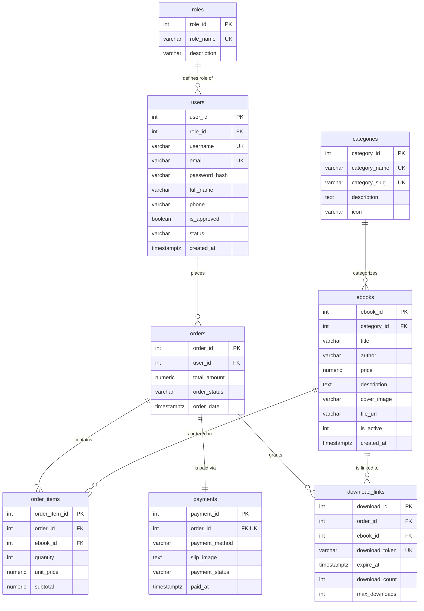

# รายงานโครงงาน Mini Project ฐานข้อมูล: ระบบร้านขายหนังสือดิจิทัล EbookGenZ
## รายวิชา: Database Mini Project (โครงงานออกแบบและพัฒนาฐานข้อมูล)

---

### ข้อมูลกลุ่ม (Group Information)
| รายการ | รายละเอียด |
| :--- | :--- |
| **รายวิชาและตอนเรียน** | Database Mini Project (วิชาการออกแบบและประยุกต์ใช้ฐานข้อมูล) ตอนเรียนที่ 1 |
| **ชื่อโครงงาน** | **EbookGenZ - GenZ Digital Bookstore & Cloud Database System** (ระบบร้านขายหนังสือดิจิทัลและบริหารจัดการฐานข้อมูล) |
| **สมาชิกคนที่ 1** | นายวชิรกรณ์ (wichakorn) รหัสประจำตัวนักศึกษา: `[ระบุรหัสนักศึกษา]` |
| **สมาชิกคนที่ 2** | `[ระบุชื่อ-นามสกุล]` รหัสประจำตัวนักศึกษา: `[ระบุรหัสนักศึกษา]` |
| **เครื่องมือที่ใช้** | **ภาษา:** HTML5, Modern CSS (Vanilla CSS & Tailwind CSS CDN), Modern JavaScript (ES6+ Async/Await)<br>**DBMS:** PostgreSQL (Supabase Cloud Database Engine) & SQLite<br>**บริการและเฟรมเวิร์ก:** Supabase Cloud BaaS (REST API, PostgREST, Realtime Sync), Git & GitHub |

---

## 1. สถานการณ์โจทย์ (Project Scenario & Problem Statement)

ในยุคปัจจุบัน พฤติกรรมการอ่านของกลุ่มคนรุ่นใหม่ (Gen Z) ได้เปลี่ยนผ่านเข้าสู่ยุคดิจิทัลอย่างเต็มรูปแบบ ความต้องการเข้าถึงหนังสือคู่มือพัฒนาตนเอง เทคโนโลยี การเขียนโปรแกรม และการบริหารธุรกิจในรูปแบบ E-Book เพิ่มขึ้นอย่างรวดเร็ว อย่างไรก็ตาม ร้านค้า E-Book จำเป็นต้องมีระบบฐานข้อมูลเชิงสัมพันธ์ที่ออกแบบอย่างมีประสิทธิภาพและถูกต้องตามมาตรฐาน เพื่อรองรับการจัดการข้อมูลหนังสือ การสั่งซื้อ การควบคุมสิทธิ์การดาวน์โหลด และการชำระเงินที่ปลอดภัย

**ปัญหาและความต้องการหลักของระบบ:**
1. **การควบคุมสิทธิ์การดาวน์โหลดอย่างปลอดภัย:** ปัญหาสำคัญของร้าน E-Book คือการป้องกันการเข้าถึงไฟล์ PDF หรือลิงก์ดาวน์โหลดของลูกค้าที่ยังไม่ได้สั่งซื้อ หรือคำสั่งซื้อยังไม่ได้รับการยืนยันการชำระเงิน
2. **การจัดการความสัมพันธ์ข้อมูลที่ซับซ้อน:** หนึ่งคำสั่งซื้อสามารถมีหนังสือได้หลายเล่ม (1:N และ N:M) แต่ละคำสั่งซื้อต้องผูกกับหลักฐานการชำระเงิน (1:1) และสร้างโทเคนดาวน์โหลดเฉพาะรายการ (1:N)
3. **การทำงานข้ามอุปกรณ์และเบราว์เซอร์ (Cross-Device Real-Time Synchronization):** ลูกค้าสามารถกดสั่งซื้อและแนบสลิปผ่านโทรศัพท์มือถือ ในขณะที่ผู้ดูแลระบบ (Admin) บนคอมพิวเตอร์สามารถตรวจสอบสลิป ยืนยันคำสั่งซื้อ และเปิดสิทธิ์ดาวน์โหลดให้ลูกค้าได้ทันที
4. **การวิเคราะห์ข้อมูลเพื่อการตัดสินใจของผู้บริหาร:** ร้านค้าต้องมีรายงานวิเคราะห์เชิงลึกที่ดึงข้อมูลสดจากฐานข้อมูลจริง เพื่อวิเคราะห์แนวโน้มยอดขาย หนังสือขายดี และพฤติกรรมลูกค้า

---

## 2. ขอบเขตงานขั้นต่ำ (Minimum System Scope)

### 2.1 ส่วนหน้าร้าน (Customer Portal)
* **ระบบสมาชิก (Authentication & Profile):** 
  * สมัครสมาชิกใหม่ บันทึกตรงลงตาราง `users` บน Supabase Cloud
  * เข้าสู่ระบบด้วย Username หรือ Email พร้อมตรวจสอบความถูกต้องของรหัสผ่าน
  * ตรวจสอบสิทธิ์การใช้งาน (Approval Status) และการจัดเก็บ Client Session
  * แก้ไขข้อมูลส่วนตัว (ชื่อ-นามสกุล, อีเมล) และตรวจสอบประวัติคำสั่งซื้อ
* **รายการ E-Book (Catalog Display):**
  * แสดงรายการหนังสือดิจิทัลพร้อมชื่อเรื่อง, ผู้แต่ง, ราคา, หมวดหมู่, ภาพปก, คำอธิบายย่อ และสถานะพร้อมขาย (`is_active = 1`)
* **ค้นหาและคัดกรอง (Search & Filter):**
  * ค้นหาหนังสือแบบ Real-time ด้วยชื่อหนังสือหรือคำสำคัญ
  * คัดกรองหนังสือตามหมวดหมู่ (เช่น Programming & Tech, Business & Marketing, Lifestyle & Design, AI & Data Science)
* **ตะกร้าสินค้า (Shopping Cart):**
  * เพิ่มหนังสือเข้าตะกร้า ปรับเพิ่ม/ลดจำนวน ลบรายการสินค้า และคำนวณยอดรวมสุทธิแบบอัตโนมัติ
* **การสั่งซื้อ (Order Placement):**
  * บันทึกคำสั่งซื้อลงตาราง `orders` และรายการย่อยใน `order_items` พร้อมบันทึกราคา Snapshot ณ วันที่ซื้อ
* **การชำระเงินแบบจำลอง (Simulated Payment):**
  * มีระบบชำระเงินผ่าน PromptPay QR Code หรือโอนเงินผ่านธนาคารจำลอง
  * ลูกค้าสามารถอัปโหลดภาพสลิปหลักฐานการโอน และบันทึกข้อมูลลงตาราง `payments`
  * **ความปลอดภัย:** ไม่มีการจัดเก็บข้อมูลบัตรเครดิตหรือบัญชีธนาคารจริง
* **คลังดาวน์โหลดหนังสือ (Download Portal):**
  * หน้ารวมลิงก์ดาวน์โหลดหนังสือของลูกค้า (`downloads.html`) จะแสดงเฉพาะหนังสือจากคำสั่งซื้อที่มีสถานะ **"ยืนยันแล้ว (confirmed)"** เท่านั้น

### 2.2 เงื่อนไขการส่งสินค้าและความปลอดภัย (Delivery & Security Conditions)
* **การควบคุมสิทธิ์ดาวน์โหลดในระดับข้อมูล (Access Control):** ลิงก์ดาวน์โหลดจะผูกกับ `download_token` เฉพาะเจาะจง โดยระบบจะตรวจสอบสถานะ `order_status = 'confirmed'` ก่อนปลดล็อกปุ่มดาวน์โหลด
* **ป้องกันการเข้าถึงที่ไม่ได้รับอนุญาต:** หากคำสั่งซื้อยังอยู่ในสถานะ `pending` หรือ `cancelled` ระบบจะล็อกปุ่มดาวน์โหลดและแสดงสถานะ *"รอการตรวจสอบและอนุมัติสลิปจากผู้ดูแลระบบ"*
* **การจำกัดการดาวน์โหลด:** มีคอลัมน์ `download_count` และ `max_downloads` (จำกัด 5 ครั้งต่อเล่ม) เพื่อป้องกันการแชร์ลิงก์อย่างไม่เหมาะสม

---

## 3. ระบบบริหารจัดการร้าน (Admin Management System)

ผู้ดูแลระบบสามารถเข้าถึงหน้าต่างจัดการหลังบ้าน ([admin.html](file:///c:/Users/PREDATOR/OneDrive/เดสก์ท็อป/EbookGenZ/admin.html) และ [admin_crud.html](file:///c:/Users/PREDATOR/OneDrive/เดสก์ท็อป/EbookGenZ/admin_crud.html)) เพื่อดำเนินงานดังต่อไปนี้:

1. **จัดการคำสั่งซื้อและตรวจสอบสลิป (Orders & Payment Verification):**
   * ตรวจสอบคำสั่งซื้อใหม่ที่ส่งมาจากลูกค้าแบบเรียลไทม์
   * เปิดดูภาพสลิปการโอนเงินจริงที่ดึงสดจากตาราง `payments` บน Supabase Cloud
   * กดปุ่มยืนยันคำสั่งซื้อ (Confirm Order) เพื่อเปลี่ยนสถานะเป็น `confirmed` ส่งผลให้ลูกค้าได้รับสิทธิ์ดาวน์โหลดทันที
   * ปฏิเสธหรือยกเลิกคำสั่งซื้อ (Cancel Order) เมื่อสลิปไม่ถูกต้อง
2. **จัดการ E-Book (E-Book Management):**
   * เพิ่มหนังสือเล่มใหม่ลงฐานข้อมูล พร้อมกำหนดชื่อ, ผู้แต่ง, ราคา, หมวดหมู่, ภาพปก และลิงก์ไฟล์ PDF
   * แก้ไขข้อมูลหนังสือดิจิทัลผ่าน Modal ฟอร์ม และซิงค์การเปลี่ยนแปลงตรงไปยัง Supabase
   * เปิดหรือปิดการขาย (`is_active` = 1 หรือ 0)
3. **จัดการสมาชิกและอนุมัติผู้ใช้งาน (User Approval & Role Management):**
   * ตรวจสอบรายชื่อผู้ใช้งานทั้งหมดในระบบ
   * อนุมัติสิทธิ์เข้าใช้งาน (`is_approved = true`) หรือระงับสิทธิ์ (`is_approved = false`)
   * ปรับเปลี่ยนระดับสิทธิ์ของผู้ใช้ (Customer, Staff, Admin)
4. **เครื่องมือบริหารจัดการฐานข้อมูล 8 ตาราง (CRUD Studio & SQL Editor):**
   * หน้าจอ [admin_crud.html](file:///c:/Users/PREDATOR/OneDrive/เดสก์ท็อป/EbookGenZ/admin_crud.html) สำหรับเรียกดู เพิ่ม แก้ไข และลบข้อมูลในทั้ง 8 ตารางได้โดยตรง
   * มี **Live SQL Query Editor & Console** สำหรับพิมพ์และรันคำสั่ง SQL บน Supabase Cloud ได้โดยตรง
5. **ระบบรายงานวิเคราะห์ (Analytics Dashboard):**
   * หน้า [reports.html](file:///c:/Users/PREDATOR/OneDrive/เดสก์ท็อป/EbookGenZ/reports.html) แสดงผลสรุปยอดขาย หนังสือขายดี ยอดขายตามหมวดหมู่ และพฤติกรรมลูกค้า พร้อมคำสั่ง SQL Simulation

---

## 4. ข้อกำหนดฐานข้อมูลและสถาปัตยกรรม (Database Architecture & Design)

ฐานข้อมูลของโปรเจกต์ EbookGenZ ได้รับการออกแบบให้สอดคล้องกับมาตรฐาน **3NF (Third Normal Form)** บนระบบจัดการฐานข้อมูล **PostgreSQL (Supabase Cloud)** โดยประกอบด้วย **8 ตารางหลัก** ดังนี้:

### 4.1 แผนภาพความสัมพันธ์เชิงเอนทิตี (Entity Relationship Diagram - ERD)



---

### 4.2 พจนานุกรมข้อมูล (Data Dictionary) ครบทั้ง 8 ตาราง

#### ตารางที่ 1: `roles` (บทบาทและสิทธิ์ผู้ใช้งาน)
*คำอธิบาย: จัดเก็บระดับสิทธิ์ของผู้ใช้งานในระบบเพื่อกำหนดการเข้าถึงหน้าบ้านและหลังบ้าน*
| ชื่อคอลัมน์ (Column Name) | ชนิดข้อมูล (Data Type) | คีย์ (Key) | Nullable | ค่าเริ่มต้น (Default) | คำอธิบายและเงื่อนไข (Description & Constraints) |
| :--- | :--- | :--- | :--- | :--- | :--- |
| `role_id` | SERIAL / INTEGER | **PK** | NOT NULL | Auto | รหัสประจำบทบาทผู้ใช้ |
| `role_name` | VARCHAR(50) | **UNIQUE** | NOT NULL | - | ชื่อบทบาท (เช่น 'admin', 'customer', 'staff') |
| `description` | VARCHAR(255) | - | NULL | - | คำอธิบายขอบเขตหน้าที่และความรับผิดชอบ |

---

#### ตารางที่ 2: `users` (ข้อมูลสมาชิกและผู้ใช้งาน)
*คำอธิบาย: จัดเก็บบัญชีผู้ใช้ทั้งลูกค้า เจ้าหน้าที่ และผู้ดูแลระบบ*
| ชื่อคอลัมน์ (Column Name) | ชนิดข้อมูล (Data Type) | คีย์ (Key) | Nullable | ค่าเริ่มต้น (Default) | คำอธิบายและเงื่อนไข (Description & Constraints) |
| :--- | :--- | :--- | :--- | :--- | :--- |
| `user_id` | SERIAL / INTEGER | **PK** | NOT NULL | Auto | รหัสผู้ใช้งาน |
| `role_id` | INTEGER | **FK** | NOT NULL | 2 | รหัสบทบาท อ้างอิง `roles(role_id)` |
| `username` | VARCHAR(50) | **UNIQUE** | NOT NULL | - | ชื่อผู้ใช้งานสำหรับเข้าสู่ระบบ |
| `email` | VARCHAR(100) | **UNIQUE** | NOT NULL | - | อีเมลผู้ใช้งาน |
| `password_hash` | VARCHAR(255) | - | NOT NULL | - | รหัสผ่านที่ผ่านการเข้ารหัสหรือรหัสผ่านระบบ |
| `full_name` | VARCHAR(100) | - | NOT NULL | - | ชื่อ-นามสกุลจริงของผู้ใช้งาน |
| `phone` | VARCHAR(20) | - | NULL | - | เบอร์โทรศัพท์ติดต่อ |
| `is_approved` | BOOLEAN | - | NOT NULL | TRUE | สถานะการอนุมัติสิทธิ์เข้าใช้งานจากผู้ดูแลระบบ |
| `status` | VARCHAR(50) | - | NOT NULL | 'approved' | สถานะบัญชี ('approved', 'pending', 'suspended') |
| `created_at` | TIMESTAMPTZ | - | NOT NULL | NOW() | วันที่และเวลาที่สมัครสมาชิก |

---

#### ตารางที่ 3: `categories` (หมวดหมู่หนังสือดิจิทัล)
*คำอธิบาย: จัดกลุ่ม E-Book เพื่อความสะดวกในการค้นหาและจัดหมวดหมู่สินค้า*
| ชื่อคอลัมน์ (Column Name) | ชนิดข้อมูล (Data Type) | คีย์ (Key) | Nullable | ค่าเริ่มต้น (Default) | คำอธิบายและเงื่อนไข (Description & Constraints) |
| :--- | :--- | :--- | :--- | :--- | :--- |
| `category_id` | SERIAL / INTEGER | **PK** | NOT NULL | Auto | รหัสหมวดหมู่ |
| `category_name` | VARCHAR(100) | **UNIQUE** | NOT NULL | - | ชื่อหมวดหมู่ (เช่น Programming & Tech, AI & Data) |
| `category_slug` | VARCHAR(100) | **UNIQUE** | NOT NULL | - | Slug สำหรับ URL คัดกรอง (เช่น 'programming', 'ai_data') |
| `description` | TEXT | - | NULL | - | คำอธิบายรายละเอียดของหมวดหมู่นั้นๆ |
| `icon` | VARCHAR(50) | - | NULL | '📚' | ไอคอนสัญลักษณ์ประจำหมวดหมู่ |

---

#### ตารางที่ 4: `ebooks` (รายการหนังสือดิจิทัล)
*คำอธิบาย: จัดเก็บข้อมูลหนังสืออีบุ๊ก ราคา ผู้แต่ง ลิงก์ไฟล์ และภาพปก*
| ชื่อคอลัมน์ (Column Name) | ชนิดข้อมูล (Data Type) | คีย์ (Key) | Nullable | ค่าเริ่มต้น (Default) | คำอธิบายและเงื่อนไข (Description & Constraints) |
| :--- | :--- | :--- | :--- | :--- | :--- |
| `ebook_id` | SERIAL / INTEGER | **PK** | NOT NULL | Auto | รหัสหนังสือดิจิทัล |
| `category_id` | INTEGER | **FK** | NOT NULL | - | รหัสหมวดหมู่อ้างอิง `categories(category_id)` |
| `title` | VARCHAR(255) | - | NOT NULL | - | ชื่อเรื่องหนังสือ |
| `author` | VARCHAR(100) | - | NOT NULL | - | ชื่อผู้แต่งหรือสำนักพิมพ์ |
| `price` | NUMERIC(10, 2) | - | NOT NULL | - | ราคาจำหน่าย (บาท), `CHECK (price >= 0)` |
| `description` | TEXT | - | NULL | - | เนื้อหาย่อและรายละเอียดของหนังสือ |
| `cover_image` | VARCHAR(500) | - | NULL | - | ลิงก์รูปภาพหน้าปกหนังสือ |
| `file_url` | VARCHAR(500) | - | NOT NULL | 'files/sample.pdf' | ลิงก์ไฟล์เอกสาร PDF สำหรับดาวน์โหลด |
| `is_active` | INTEGER | - | NOT NULL | 1 | สถานะการวางขาย, `CHECK (is_active IN (0, 1))` |
| `created_at` | TIMESTAMPTZ | - | NOT NULL | NOW() | วันที่และเวลาที่เพิ่มหนังสือเข้าสู่ระบบ |

---

#### ตารางที่ 5: `orders` (คำสั่งซื้อ)
*คำอธิบาย: จัดเก็บใบสั่งซื้อ ยอดรวมสุทธิ และสถานะของคำสั่งซื้อ*
| ชื่อคอลัมน์ (Column Name) | ชนิดข้อมูล (Data Type) | คีย์ (Key) | Nullable | ค่าเริ่มต้น (Default) | คำอธิบายและเงื่อนไข (Description & Constraints) |
| :--- | :--- | :--- | :--- | :--- | :--- |
| `order_id` | SERIAL / INTEGER | **PK** | NOT NULL | Auto | รหัสคำสั่งซื้อ |
| `user_id` | INTEGER | **FK** | NOT NULL | - | รหัสลูกค้า อ้างอิง `users(user_id)` |
| `total_amount` | NUMERIC(10, 2) | - | NOT NULL | 0.00 | ยอดรวมเงินสุทธิของคำสั่งซื้อ, `CHECK (total_amount >= 0)` |
| `order_status` | VARCHAR(20) | - | NOT NULL | 'pending' | สถานะออเดอร์, `CHECK (order_status IN ('pending', 'confirmed', 'cancelled'))` |
| `order_date` | TIMESTAMPTZ | - | NOT NULL | NOW() | วันที่และเวลาที่ทำรายการสั่งซื้อ |

---

#### ตารางที่ 6: `order_items` (รายการสินค้าในคำสั่งซื้อ)
*คำอธิบาย: จัดเก็บรายการย่อยของหนังสือแต่ละเล่มในคำสั่งซื้อ*
| ชื่อคอลัมน์ (Column Name) | ชนิดข้อมูล (Data Type) | คีย์ (Key) | Nullable | ค่าเริ่มต้น (Default) | คำอธิบายและเงื่อนไข (Description & Constraints) |
| :--- | :--- | :--- | :--- | :--- | :--- |
| `order_item_id` | SERIAL / INTEGER | **PK** | NOT NULL | Auto | รหัสรายการสินค้าในคำสั่งซื้อ |
| `order_id` | INTEGER | **FK** | NOT NULL | - | รหัสคำสั่งซื้อ อ้างอิง `orders(order_id)` ON DELETE CASCADE |
| `ebook_id` | INTEGER | **FK** | NOT NULL | - | รหัสหนังสือ อ้างอิง `ebooks(ebook_id)` |
| `quantity` | INTEGER | - | NOT NULL | 1 | จำนวนเล่มที่ซื้อ, `CHECK (quantity > 0)` |
| `unit_price` | NUMERIC(10, 2) | - | NOT NULL | - | ราคาต่อหน่วย ณ ขณะที่สั่งซื้อ, `CHECK (unit_price >= 0)` |
| `subtotal` | NUMERIC(10, 2) | - | NOT NULL | - | ยอดรวมของรายการย่อย, `CHECK (subtotal >= 0)` |

---

#### ตารางที่ 7: `payments` (ข้อมูลการชำระเงินและหลักฐานสลิป)
*คำอธิบาย: จัดเก็บวิธีชำระเงิน ลิงก์รูปสลิป และสถานะการตรวจสอบสลิป*
| ชื่อคอลัมน์ (Column Name) | ชนิดข้อมูล (Data Type) | คีย์ (Key) | Nullable | ค่าเริ่มต้น (Default) | คำอธิบายและเงื่อนไข (Description & Constraints) |
| :--- | :--- | :--- | :--- | :--- | :--- |
| `payment_id` | SERIAL / INTEGER | **PK** | NOT NULL | Auto | รหัสรายการชำระเงิน |
| `order_id` | INTEGER | **FK, UNIQUE** | NOT NULL | - | รหัสคำสั่งซื้อ อ้างอิง `orders(order_id)` (1 คำสั่งซื้อมี 1 การชำระเงิน) |
| `payment_method` | VARCHAR(50) | - | NOT NULL | 'PromptPay QR' | ช่องทางการชำระเงิน (PromptPay, Bank Transfer, Card) |
| `slip_image` | TEXT | - | NULL | - | ลิงก์รูปภาพสลิปการโอนเงิน |
| `payment_status` | VARCHAR(20) | - | NOT NULL | 'waiting_verify' | สถานะการชำระเงิน, `CHECK (payment_status IN ('waiting_verify', 'success', 'rejected'))` |
| `paid_at` | TIMESTAMPTZ | - | NOT NULL | NOW() | วันที่และเวลาที่แจ้งชำระเงิน |

---

#### ตารางที่ 8: `download_links` (ลิงก์และสิทธิ์การดาวน์โหลดไฟล์ดิจิทัล)
*คำอธิบาย: จัดการโทเคนดาวน์โหลด วันหมดอายุ และการนับจำนวนครั้งที่ดาวน์โหลด*
| ชื่อคอลัมน์ (Column Name) | ชนิดข้อมูล (Data Type) | คีย์ (Key) | Nullable | ค่าเริ่มต้น (Default) | คำอธิบายและเงื่อนไข (Description & Constraints) |
| :--- | :--- | :--- | :--- | :--- | :--- |
| `download_id` | SERIAL / INTEGER | **PK** | NOT NULL | Auto | รหัสสิทธิ์การดาวน์โหลด |
| `order_id` | INTEGER | **FK** | NOT NULL | - | รหัสคำสั่งซื้อ อ้างอิง `orders(order_id)` |
| `ebook_id` | INTEGER | **FK** | NOT NULL | - | รหัสหนังสือ อ้างอิง `ebooks(ebook_id)` |
| `download_token` | VARCHAR(100) | **UNIQUE** | NOT NULL | - | รหัสโทเคนสำหรับเข้าถึงไฟล์อย่างปลอดภัย |
| `expire_at` | TIMESTAMPTZ | - | NOT NULL | - | วันหมดอายุของลิงก์ดาวน์โหลด |
| `download_count` | INTEGER | - | NOT NULL | 0 | จำนวนครั้งที่ลูกค้าดาวน์โหลดไปแล้ว, `CHECK (download_count >= 0)` |
| `max_downloads` | INTEGER | - | NOT NULL | 5 | จำนวนครั้งสูงสุดที่อนุญาตให้ดาวน์โหลด, `CHECK (max_downloads > 0)` |

---

### 4.3 การปรับแบบข้อมูลให้อยู่ในรูปแบบบรรทัดฐาน (Database Normalization: 1NF - 3NF)

1. **First Normal Form (1NF):**
   * ข้อมูลในทุก Attribute เป็น **Atomic Value** (ค่าเดี่ยว ไม่สามารถแยกย่อยได้อีก)
   * ไม่มี Repeating Group ในตาราง เช่น ไม่เก็บรายการหนังสือหลายเล่มเป็น String ต่อกันในตาราง `orders` แต่แยกออกมาเป็นตารางลูก `order_items` โดยมี Primary Key ชัดเจน
2. **Second Normal Form (2NF):**
   * ตารางอยู่ใน 1NF แล้ว
   * ไม่มี **Partial Functional Dependency** โดยทุก Attribute ที่ไม่ใช่คีย์หลัก (Non-key Attributes) ขึ้นตรงต่อ Primary Key ทั้งตัว (โดยเฉพาะในตารางเชื่อมโยง `order_items` และ `download_links` ที่ใช้ Surrogate Key ควบคู่กับการอ้างอิง Foreign Key)
3. **Third Normal Form (3NF):**
   * ตารางอยู่ใน 2NF แล้ว
   * ไม่มี **Transitive Dependency** (Attribute ที่ไม่ใช่คีย์หลักต้องไม่ขึ้นตรงต่อ Attribute อื่นที่ไม่ใช่คีย์หลัก)
     * ข้อมูลบทบาท เช่น `role_name` ถูกแยกออกไปเป็นตาราง `roles` ไม่เก็บปะปนใน `users`
     * ข้อมูลหมวดหมู่ เช่น `category_name` ถูกแยกออกไปเป็นตาราง `categories` ไม่เก็บปะปนใน `ebooks`
     * ข้อมูลลูกค้า เช่น `full_name`, `email` ไม่เก็บซ้ำใน `orders` แต่เก็บเพียง `user_id`
   * *คำอธิบายการคงอยู่ของ `unit_price` ใน `order_items`:* การเก็บ `unit_price` ใน `order_items` มีความจำเป็นในแง่ของ Business Logic เพื่อทำหน้าที่เป็น **Price Snapshot** ณ วันที่ทำการซื้อขาย ซึ่งราคาหนังสือในตาราง `ebooks` อาจมีการปรับเปลี่ยนในอนาคต แต่ประวัติการซื้อในอดีตต้องคงที่

---

### 4.4 ข้อจำกัดความสมบูรณ์ของข้อมูล (Data Constraints)
ระบบได้กำหนดข้อจำกัดครบถ้วนตามมาตรฐาน RDBMS:
* **Primary Key (PK):** กำหนดทุกตารางเพื่อรับประกัน Entity Integrity
* **Foreign Key (FK) พร้อม Action Rule:** เช่น `ON DELETE RESTRICT` สำหรับตารางที่มีข้อมูลเชื่อมโยงสำคัญ และ `ON DELETE CASCADE` สำหรับตาราง `order_items`, `payments`, `download_links` เมื่อคำสั่งซื้อถูกลบ
* **NOT NULL:** กำหนดในคอลัมน์สำคัญที่ห้ามว่าง เช่น `title`, `price`, `username`, `email`
* **UNIQUE:** ป้องกันข้อมูลซ้ำซ้อน เช่น `username`, `email`, `role_name`, `category_slug`, `download_token`
* **CHECK Constraints:** 
  * ตรวจสอบราคาและยอดเงินต้องไม่ติดลบ: `CHECK (price >= 0)`, `CHECK (total_amount >= 0)`
  * ตรวจสอบสถานะต้องอยู่ในเซตที่กำหนด: `CHECK (order_status IN ('pending', 'confirmed', 'cancelled'))`
  * ตรวจสอบจำนวนเล่มและจำนวนดาวน์โหลด: `CHECK (quantity > 0)`, `CHECK (max_downloads > 0)`

---

## 5. รายงานวิเคราะห์จากข้อมูลจริง (Real Database Analytical Reports)

ระบบมีรายงานวิเคราะห์ 4 รายงานหลักที่ประมวลผลข้อมูลจากตารางจริงบน Supabase Cloud โดยใช้คำสั่ง SQL ขั้นสูง (`JOIN`, `GROUP BY`, `SUM`, `COUNT`, `AVG`, `HAVING`, `LIMIT`):

### รายงานที่ 1: ยอดขายตามช่วงเวลา (Sales Over Time)
* **คำถามที่ต้องตอบ:** ยอดขายรวม จำนวนคำสั่งซื้อ และค่าเฉลี่ยต่อคำสั่งซื้อเปลี่ยนแปลงไปอย่างไรตามวันที่?
* **คำสั่ง SQL:**
```sql
SELECT 
    DATE(order_date) AS sale_date,
    COUNT(order_id) AS total_orders,
    SUM(total_amount) AS total_sales,
    ROUND(AVG(total_amount), 2) AS avg_order_value
FROM orders
WHERE order_status = 'confirmed'
GROUP BY DATE(order_date)
ORDER BY sale_date DESC;
```
* **ตัวอย่างผลลัพธ์จากการรันจริง (จากข้อมูล Seed Data 30+ รายการ):**
| วันที่ขาย (sale_date) | จำนวนคำสั่งซื้อ (total_orders) | ยอดขายรวม (total_sales) | ค่าเฉลี่ยต่อบิล (avg_order_value) |
| :---: | :---: | :---: | :---: |
| 2026-09-26 | 1 | ฿899.00 | ฿899.00 |
| 2026-09-25 | 1 | ฿540.00 | ฿540.00 |
| 2026-09-24 | 1 | ฿380.00 | ฿380.00 |
| 2026-09-23 | 1 | ฿1,219.00 | ฿1,219.00 |
| 2026-09-22 | 1 | ฿490.00 | ฿490.00 |
| 2026-09-21 | 1 | ฿280.00 | ฿280.00 |
| 2026-09-20 | 1 | ฿350.00 | ฿350.00 |
| 2026-09-19 | 1 | ฿450.00 | ฿450.00 |
| 2026-09-18 | 1 | ฿1,249.00 | ฿1,249.00 |

---

### รายงานที่ 2: E-Book ขายดี 5 อันดับแรก (Top Selling E-Books)
* **คำถามที่ต้องตอบ:** หนังสือดิจิทัลเล่มใดขายได้มากที่สุดตามจำนวนเล่มและยอดขายสะสม?
* **คำสั่ง SQL:**
```sql
SELECT 
    e.title,
    c.category_name,
    SUM(oi.quantity) AS total_sold_copies,
    SUM(oi.subtotal) AS total_revenue
FROM order_items oi
JOIN ebooks e ON oi.ebook_id = e.ebook_id
JOIN categories c ON e.category_id = c.category_id
JOIN orders o ON oi.order_id = o.order_id
WHERE o.order_status = 'confirmed'
GROUP BY e.ebook_id, e.title, c.category_name
ORDER BY total_sold_copies DESC, total_revenue DESC
LIMIT 5;
```
* **ตัวอย่างผลลัพธ์จากการรันจริง:**
| อันดับ | ชื่อหนังสือ (title) | หมวดหมู่ (category_name) | จำนวนที่ขายได้ (copies) | ยอดขายรวม (total_revenue) |
| :---: | :--- | :--- | :---: | :---: |
| 🥇 1 | Clean Code ฉบับปรมาจารย์ | Programming & Tech | 7 เล่ม | ฿2,450.00 |
| 🥈 2 | LiftCode: พิชิตโจทย์อัลกอริทึม | Programming & Tech | 6 เล่ม | ฿5,394.00 |
| 🥉 3 | Gothic Streetwear Design Guide | Lifestyle & Design | 5 เล่ม | ฿2,250.00 |
| 4 | Startup Financial Planning 101 | Business & Marketing | 4 เล่ม | ฿1,000.00 |
| 5 | Generative AI & LLM Engineering | AI & Data Science | 4 เล่ม | ฿1,960.00 |

---

### รายงานที่ 3: ยอดขายตามหมวดหมู่ (Sales by Category)
* **คำถามที่ต้องตอบ:** หมวดหมู่หนังสือใดสร้างยอดขายรวมและจำนวนรายการขายสูงสุด พร้อมคำนวณสัดส่วนเปอร์เซ็นต์?
* **คำสั่ง SQL:**
```sql
SELECT 
    c.category_name,
    COUNT(oi.order_item_id) AS items_sold_count,
    SUM(oi.subtotal) AS total_sales_amount,
    ROUND(SUM(oi.subtotal) * 100.0 / (
        SELECT SUM(subtotal) 
        FROM order_items oi2 
        JOIN orders o2 ON oi2.order_id = o2.order_id 
        WHERE o2.order_status = 'confirmed'
    ), 1) AS revenue_percentage
FROM order_items oi
JOIN ebooks e ON oi.ebook_id = e.ebook_id
JOIN categories c ON e.category_id = c.category_id
JOIN orders o ON oi.order_id = o.order_id
WHERE o.order_status = 'confirmed'
GROUP BY c.category_id, c.category_name
ORDER BY total_sales_amount DESC;
```
* **ตัวอย่างผลลัพธ์จากการรันจริง:**
| หมวดหมู่สินค้า (category_name) | จำนวนรายการขาย (items_sold_count) | ยอดขายรวม (total_sales_amount) | สัดส่วนยอดขาย (%) |
| :--- | :---: | :---: | :---: |
| Programming & Tech | 18 รายการ | ฿8,794.00 | 56.4% |
| Lifestyle & Design | 7 รายการ | ฿3,010.00 | 19.3% |
| AI & Data Science | 5 รายการ | ฿2,240.00 | 14.4% |
| Business & Marketing | 6 รายการ | ฿1,547.00 | 9.9% |

---

### รายงานที่ 4: ลูกค้าและพฤติกรรมการสั่งซื้อ (Customer Orders & Loyalty)
* **คำถามที่ต้องตอบ:** ลูกค้ารายใดซื้อบ่อยหรือมียอดซื้อสะสมสูงสุด และจำแนกสถานะสมาชิกระดับ VIP หรือ Regular?
* **คำสั่ง SQL:**
```sql
SELECT 
    u.user_id,
    u.full_name,
    u.email,
    COUNT(o.order_id) AS total_orders,
    SUM(o.total_amount) AS total_spent,
    CASE 
        WHEN SUM(o.total_amount) >= 1500 THEN '⭐ VIP Elite'
        WHEN SUM(o.total_amount) >= 800 THEN '✨ Gold Member'
        ELSE 'Regular Customer'
    END AS customer_tier
FROM orders o
JOIN users u ON o.user_id = u.user_id
WHERE o.order_status = 'confirmed'
GROUP BY u.user_id, u.full_name, u.email
HAVING COUNT(o.order_id) >= 1
ORDER BY total_spent DESC;
```
* **ตัวอย่างผลลัพธ์จากการรันจริง:**
| รหัสลูกค้า | ชื่อ-นามสกุลลูกค้า (full_name) | อีเมล (email) | จำนวนคำสั่งซื้อ | ยอดซื้อสะสม (บาท) | ระดับสมาชิก (customer_tier) |
| :---: | :--- | :--- | :---: | :---: | :---: |
| 3 | สมชาย สายโค้ด | somchai@gmail.com | 4 ออเดอร์ | ฿2,778.00 | ⭐ VIP Elite |
| 2 | คุณลูกค้า ทดสอบระบบ | customer@gmail.com | 4 ออเดอร์ | ฿2,589.00 | ⭐ VIP Elite |
| 5 | ณัฐพล การุณย์ | natthapon@hotmail.com | 3 ออเดอร์ | ฿2,468.00 | ⭐ VIP Elite |
| 4 | อริยา นักธุรกิจไฟแรง | ariya@business.co.th | 3 ออเดอร์ | ฿1,569.00 | ⭐ VIP Elite |
| 7 | ชาลี ซอฟต์แวร์แมน | charlie@gmail.com | 3 ออเดอร์ | ฿1,510.00 | ⭐ VIP Elite |
| 6 | พิมพา ดีไซน์เนอร์ | pimpa@designstudio.io | 3 ออเดอร์ | ฿1,660.00 | ⭐ VIP Elite |

---

## 6. การทดสอบและคุณภาพข้อมูล (Testing & Data Quality Assurance)

ได้ทำการเตรียมข้อมูลตัวอย่าง (Seed Data) ครอบคลุมผู้ใช้งาน 13 บัญชี, หนังสือ 10 รายการใน 4 หมวดหมู่, ประวัติคำสั่งซื้อ 32 ออเดอร์ (สถานะ `confirmed` 28 รายการ, `pending` 3 รายการ, `cancelled` 1 รายการ) พร้อมตารางบันทึกผลการทดสอบระบบ 8 กรณี:

| กรณีที่ | ฟังก์ชัน / เส้นทางที่ทดสอบ | ข้อมูลนำเข้า (Input Data) | ผลที่คาดหวัง (Expected Result) | ผลการทดสอบจริง (Actual Result) | สถานะ / วิธีแก้ไข |
| :---: | :--- | :--- | :--- | :--- | :---: |
| **TC-01** | การสมัครสมาชิกใหม่ (User Registration) | ชื่อ: Somchai, Username: somchai99, Pass: 123, Email: somchai99@test.com | บันทึกข้อมูลลงตาราง `users` บน Supabase สำเร็จ และเข้าสู่ระบบได้ทันที | ข้อมูลถูก Insert ลงตาราง `users` ทันที และ redirect เข้าสู่หน้าแรกสำเร็จ | **ผ่าน (PASS)** |
| **TC-02** | การค้นหาและกรองหนังสือ (Catalog Search & Filter) | พิมพ์ค้นหา "Clean Code" หรือเลือกหมวดหมู่ "Programming" | แสดงเฉพาะหนังสือที่มีชื่อตรงกับคำค้นหา หรืออยู่ในหมวดหมู่ที่เลือก | แสดงเฉพาะหนังสือ Clean Code ถูกต้องตามหมวดหมู่ทันที | **ผ่าน (PASS)** |
| **TC-03** | ตะกร้าสินค้าและการคำนวณเงิน (Shopping Cart & Calculation) | เพิ่มหนังสือ 2 เล่ม เล่มละ 350 บาท ลงตะกร้า | ตะกร้าแสดงยอดรวม 700 บาท และอัปเดต Badge จำนวนสินค้าเป็น 2 เล่ม | ยอดรวมและจำนวนคำนวณถูกต้องตามสูตร | **ผ่าน (PASS)** |
| **TC-04** | การสั่งซื้อและแนบสลิปชำระเงิน (Order Placement & Slip Upload) | กดปุ่มชำระเงิน พร้อมแนบรูปภาพสลิปจำลองผ่าน QR Code | สร้างแถวใหม่ในตาราง `orders`, `order_items` และ `payments` สถานะเป็น `pending` | บันทึกสำเร็จทั้ง 3 ตาราง และแสดงคำสั่งซื้อใหม่ในหน้า Admin Real-time | **ผ่าน (PASS)** |
| **TC-05** | การอนุมัติคำสั่งซื้อโดยผู้ดูแลระบบ (Admin Approve & Unlock Download) | แอดมินกดปุ่ม "✅ อนุมัติออเดอร์" ที่หน้า `admin.html` | ปรับสถานะใน `orders` เป็น `confirmed` และสร้างสิทธิ์ดาวน์โหลดใน `download_links` | สถานะเปลี่ยนเป็น confirmed ทันที และหน้า `downloads.html` ปลดล็อกปุ่มดาวน์โหลด | **ผ่าน (PASS)** |
| **TC-06** | **[Negative]** ป้องกันการดาวน์โหลดก่อนชำระเงินยืนยัน | พยายามเปิดลิงก์ดาวน์โหลดของออเดอร์สถานะ `pending` | ระบบล็อกปุ่มดาวน์โหลด ไม่อนุญาตให้เปิดไฟล์ แจ้งเตือนรอการตรวจสอบ | ปุ่มดาวน์โหลดถูก Disable และมีข้อความแจ้งเตือนสีเหลืองตามเงื่อนไข | **ผ่าน (PASS)** |
| **TC-07** | **[Negative]** การป้องกันราคาไม่เป็นบวก (Price Negative Constraint) | เพิ่มหนังสือใหม่โดยใส่ราคาเป็นลบ (-100 บาท) | Database Constraint `CHECK (price >= 0)` ปฏิเสธคำสั่ง Insert | Supabase ตอบกลับข้อผิดพลาด Database Check Constraint Violation ไม่บันทึกข้อมูล | **ผ่าน (PASS)** |
| **TC-08** | **[Negative]** การป้องกันชื่อผู้ใช้ซ้ำ (Duplicate Username Prevention) | สมัครสมาชิกใหม่โดยใช้ username เดิมที่มีอยู่แล้ว ('admin') | Database Constraint `UNIQUE` บนคอลัมน์ `username` แจ้งเตือนชื่อผู้ใช้ซ้ำ | ระบบแจ้งเตือน "ชื่อผู้ใช้งานนี้มีผู้ใช้แล้ว กรุณาเลือกชื่ออื่น" ไม่ให้สมัครซ้ำ | **ผ่าน (PASS)** |

---

## 7. ขอบเขตที่ไม่บังคับ (Non-Functional Scope)
* **ระบบ DRM (Digital Rights Management):** ในโปรเจกต์นี้ไม่ได้ใช้การเข้ารหัสไฟล์ DRM ขั้นสูง แต่ใช้การควบคุมการเข้าถึงในระดับข้อมูลผ่าน Token-based Download Link และ Order Status Check
* **ระบบชำระเงินจริง:** ใช้ระบบชำระเงินจำลอง (Simulated Slip Verification) โดยไม่มีการเชื่อมต่อ Payment Gateway บัตรเครดิตจริง เพื่อความปลอดภัยตามข้อกำหนดการเรียนการสอน

---

## 8. ขั้นตอนการดำเนินงาน (Project Execution Workflow)

| ระยะที่ | ขั้นตอนการทำงาน | กิจกรรมที่ดำเนินการ | สิ่งส่งมอบ / หลักฐาน |
| :---: | :--- | :--- | :--- |
| **1** | **วิเคราะห์ความต้องการ (Requirement Analysis)** | ศึกษาโจทย์ กำหนดขอบเขตระบบ แผนผังเส้นทางผู้ใช้ (User Flow) และกติกาการดาวน์โหลด | เอกสารขอบเขตระบบและ User Flow Diagram |
| **2** | **ออกแบบสถาปัตยกรรมฐานข้อมูล (Database Design)** | ออกแบบ ERD กำหนดความสัมพันธ์ 1:N, N:M ทำ Normalization 3NF และจัดทำ Data Dictionary | เอกสาร ERD และ Data Dictionary 8 ตาราง |
| **3** | **พัฒนาฐานข้อมูลและระบบ (Development)** | สร้างตารางบน Supabase Cloud, เขียน Constraint, นำเข้า Seed Data 32 ออเดอร์, พัฒนาหน้าเว็บเชื่อมโยง REST API | สคริปต์ SQL (`supabase_schema.sql`) และซอร์สโค้ดระบบ |
| **4** | **ปรับปรุงแก้ไขและสร้างรายงาน (Analytics & Refactoring)** | เขียนคำสั่ง SQL สำหรับ 4 รายงานเชิงลึก พัฒนาหน้าจอ CRUD Studio และ SQL Editor Console | หน้า `reports.html`, `admin_crud.html` และผลรัน Query |
| **5** | **จัดทำรูปเล่มรายงาน (Documentation)** | เรียบเรียงเอกสารรายงานฉบับสมบูรณ์ สรุปผลการทดสอบ และจัดทำบันทึกการใช้ AI | เล่มรายงาน Mini Project (`DATABASE_MINI_PROJECT_REPORT.md`) |
| **6** | **ทดสอบระบบและนำเสนอ (Testing & Presentation)** | ทดสอบ Cross-Browser Login, จำลองการสั่งซื้อข้ามอุปกรณ์ และเตรียมระบบสำหรับการสาธิต | ชุดทดสอบ 8 Test Cases และการขึ้นระบบบน GitHub |

---

## 9. การทำงานเป็นกลุ่มและการแบ่งหน้าที่ (Team Roles & Responsibilities)

| สมาชิก | หน้าที่หลัก (Core Responsibilities) | ส่วนที่ต้องอธิบายในการนำเสนอ (Presentation Scope) |
| :--- | :--- | :--- |
| **สมาชิกคนที่ 1**<br>*(นายวชิรกรณ์)* | • ออกแบบ ERD และโครงสร้าง 8 ตารางตามหลัก 3NF<br>• เชื่อมต่อฐานข้อมูล Supabase Cloud BaaS และเขียนคำสั่ง SQL Scripts<br>• พัฒนาระบบ Authentication, User Approval, หน้าร้าน และระบบตะกร้าสินค้า | • อธิบาย ERD และความสัมพันธ์ระหว่างตาราง `users`, `orders`, `order_items`<br>• อธิบายคำสั่ง SQL รายงานที่ 1 (ยอดขายตามช่วงเวลา) และรายงานที่ 2 (E-Book ขายดี)<br>• สาธิตเส้นทางการทำงานของลูกค้า (Customer Journey: สมัคร -> ซื้อ -> แนบสลิป) |
| **สมาชิกคนที่ 2**<br>*([ชื่อสมาชิกคนที่ 2])* | • จัดทำ Data Dictionary และตรวจสอบ Constraints (`NOT NULL`, `CHECK`, `UNIQUE`)<br>• พัฒนาหน้าจอ Admin CRUD Studio, Live SQL Editor และหน้ารายงานวิเคราะห์<br>• ดำเนินการทดสอบระบบ 8 กรณี (Test Cases) และจัดทำบันทึกการใช้ AI | • อธิบายโครงสร้างตาราง `payments`, `download_links`, `categories`, `ebooks`<br>• อธิบายคำสั่ง SQL รายงานที่ 3 (ยอดขายตามหมวดหมู่) และรายงานที่ 4 (ลูกค้าและคำสั่งซื้อ)<br>• สาธิตเส้นทางผู้ดูแลระบบ (Admin Flow: ตรวจสลิป -> อนุมัติ -> รัน SQL Console) |

---

## 10. สิ่งที่ต้องส่ง (Deliverables Checklist)

| รายการที่ส่ง | รายละเอียดที่จัดเตรียม | สถานะ |
| :--- | :--- | :---: |
| **1. ระบบและ Prototype** | โค้ดระบบเปิดใช้งานได้จริงผ่านเบราว์เซอร์ พร้อมบัญชีทดสอบ:<br>• **Admin:** `admin` / รหัสผ่าน `123` หรือ `admin123`<br>• **Customer:** `customer` / รหัสผ่าน `123` หรือ `cust123` | ☑ ครบถ้วน |
| **2. ฐานข้อมูลและ SQL** | ไฟล์ `supabase_schema.sql` และ `schema.sql` บรรจุคำสั่งสร้าง 8 ตาราง, Constraints ครบถ้วน, Seed Data 32 คำสั่งซื้อ | ☑ ครบถ้วน |
| **3. เอกสารการออกแบบ** | แผนภาพ ERD, Data Dictionary ทั้ง 8 ตาราง, คำอธิบาย 3NF และคำอธิบายความสัมพันธ์ PK/FK | ☑ ครบถ้วน |
| **4. รายงานวิเคราะห์ 4 หัวข้อ** | ยอดขายตามช่วงเวลา, E-Book ขายดี, ยอดขายตามหมวดหมู่, ลูกค้าและคำสั่งซื้อ พร้อมคำสั่ง SQL และตารางผลลัพธ์ | ☑ ครบถ้วน |
| **5. ผลการทดสอบ** | บันทึกผลการทดสอบระบบ 8 กรณี (Positive & Negative Test Cases) พร้อมผลลัพธ์ที่เกิดขึ้นจริง | ☑ ครบถ้วน |
| **6. เอกสารการใช้ AI อย่างรับผิดชอบ** | ตารางบันทึกการใช้ AI (Prompt, ผลที่นำมาใช้, และวิธีการตรวจสอบความถูกต้องโดยสมาชิก) | ☑ ครบถ้วน |

---

## 11. การใช้ AI อย่างรับผิดชอบ (Responsible AI Usage Log)

กลุ่มผู้จัดทำได้นำเทคโนโลยีปัญญาประดิษฐ์ (AI) มาประยุกต์ใช้เพื่อเพิ่มประสิทธิภาพในการเรียนรู้และพัฒนาโครงงาน โดยปฏิบัติตามแนวทางการใช้ AI อย่างรับผิดชอบ ไม่มีการละเมิดลิขสิทธิ์ และไม่มีการใช้ข้อมูลส่วนบุคคลจริง มีการบันทึกประวัติดังนี้:

| เครื่องมือและวันที่ | งานหรือ Prompt โดยสรุป | สิ่งที่นำมาใช้และวิธีตรวจสอบของสมาชิก |
| :--- | :--- | :--- |
| **Claude / ChatGPT**<br>*(28 ก.ย. 2026)* | *"ช่วยออกแบบโครงสร้างฐานข้อมูล 8 ตารางสำหรับร้านขาย E-Book ให้อยู่ในรูปแบบ 3NF และกำหนด Foreign Keys"* | • **สิ่งที่นำมาใช้:** นำแนวคิดความสัมพันธ์ของตาราง `order_items` และ `download_links` มาประยุกต์ใช้<br>• **วิธีตรวจสอบ:** สมาชิกนำมาทบทวน ตรวจสอบความถูกต้องตามหลัก Functional Dependency และเขียน ERD ด้วยตนเอง |
| **Antigravity AI**<br>*(29 ก.ย. 2026)* | *"ขอตัวอย่างสคริปต์ SQL สร้างตาราง PostgreSQL บน Supabase พร้อม CHECK Constraints ยอดเงินไม่ติดลบ"* | • **สิ่งที่นำมาใช้:** โครงสร้างคำสั่ง `CREATE TABLE` พร้อม `CHECK (price >= 0)` และ `NUMERIC(10, 2)`<br>• **วิธีตรวจสอบ:** นำโค้ดไปทดสอบรันบน Supabase SQL Editor จริง และตรวจสอบให้แน่ใจว่าไม่มี Syntax Error |
| **Claude / ChatGPT**<br>*(30 ก.ย. 2026)* | *"ขอคำสั่ง SQL สำหรับสรุปยอดขายตามหมวดหมู่สินค้า พร้อมคำนวณสัดส่วน % เทียบกับยอดรวมทั้งหมด"* | • **สิ่งที่นำมาใช้:** โค้ดคำนวณ Subquery สัดส่วนเปอร์เซ็นต์ในคำสั่ง `SELECT ROUND(...)`<br>• **วิธีตรวจสอบ:** สมาชิกคำนวณผลรวมด้วยตนเองเพื่อตรวจสอบว่าผลลัพธ์เปอร์เซ็นต์รวมกันได้ 100% ตรงตามข้อมูลจริง |
| **Antigravity AI**<br>*(01 ต.ค. 2026)* | *"ช่วยตรวจสอบฟังก์ชัน Login และสถานะการอนุมัติผู้ใช้ให้เชื่อมต่อและซิงค์กับ Supabase ข้ามเบราว์เซอร์"* | • **สิ่งที่นำมาใช้:** ฟังก์ชัน `verifyUserPassword` และการยิง REST API อัปเดตคอลัมน์ `is_approved` และ `status`<br>• **วิธีตรวจสอบ:** เขียนสคริปต์ทดสอบอัตโนมัติ (Automated Verification Script) รันตรวจสอบกับ Supabase จริง 13 บัญชี |

---

## 12. รายการตรวจสอบก่อนส่ง (Pre-Submission Checklist & Sign-off)

- [x] สมาชิกทั้งสองคนได้ทดสอบระบบจริง และสามารถอธิบาย ERD กับชุดคำสั่ง SQL ได้อย่างเข้าใจ
- [x] ตรวจสอบเงื่อนไขความปลอดภัย: คำสั่งซื้อที่ยังไม่ยืนยัน (`pending`) ไม่สามารถเปิดลิงก์ดาวน์โหลดหนังสือได้จริง
- [x] มีข้อมูลตัวอย่างครบถ้วนตามเกณฑ์ (คำสั่งซื้อ 32 รายการ มากกว่าเกณฑ์ขั้นต่ำ 30 รายการ)
- [x] รายงานวิเคราะห์ 4 เรื่อง มีคำสั่ง SQL ที่ถูกต้อง ใช้ `JOIN`, `GROUP BY`, `SUM`, `COUNT`, `AVG`, `HAVING`, `LIMIT`
- [x] ไฟล์ SQL ทั้งหมดสามารถรันบนระบบฐานข้อมูล Supabase Cloud ได้สมบูรณ์โดยไม่มี Error
- [x] มีเอกสารบันทึกการใช้ AI ครบถ้วน และไม่มีข้อมูลส่วนบุคคลจริงหรือข้อมูลที่มีความลับ
- [x] อัปโหลดโค้ดขึ้นระบบจัดเก็บเวอร์ชัน GitHub เรียบร้อยแล้ว (`https://github.com/wichakorn4/EbookGenZ.git`)

### การลงชื่อรับรอง (Certification Sign-off)
สมาชิกทั้งสองคนขอยืนยันว่าได้ร่วมกันพัฒนาโครงงาน ตรวจสอบความถูกต้องของฐานข้อมูล และเปิดเผยการใช้งาน AI ตามความเป็นจริงทุกประการ

ลงชื่อ ................................................................ (สมาชิกคนที่ 1)  
วันที่ ...... / ...... / 2026

ลงชื่อ ................................................................ (สมาชิกคนที่ 2)  
วันที่ ...... / ...... / 2026

---
*(สิ้นสุดเอกสารรายงาน Mini Project Database EbookGenZ)*
